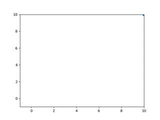

# kmeans-kohonen 

The [k-means](https://goo.gl/6qvLx2) algorithm and the [kohonen self organizing map](https://goo.gl/8bNsh) are very closely related:

## K-means
the k-means algorithm is based on optimizing the distance of the patterns in the dataset from k different prototypes.

k-means algorithm:
* **iterate**
  * **E-step** Each pattern is matched over all prototypes. The nearest prototipe indicate the cluster to which the pattern belongs 
  * **M-step** The mean of the patterns in a cluster replaces the prototypes for that cluster 

The cost function to minimize is just the sum of the squared distances of the dataset patterns from the related "winner" prototypes (nearest).

### Toy example [(code)](kmeans-toy.py):

    dataset
    
    # each row is a pattern 
    x =  [[1.0, 0.0, 0.0],
          [0.0, 1.0, 0.0],
          [0.0, 0.0, 1.0]]
           
    initial weights
    
    # each row is a prototype 
    c = [[0.02, 0.01, 0.03],
         [0.01, 0.04, 0.07],
         [0.09, 0.02, 0.02]]

**iter 0**
		
		squared_distances:
			   c0	   c1	   c2
		x0	0.961	0.987	0.829	
			    0	    0	    1	
		x1	0.981	0.927	0.969	
			    0	    1	    0	
		x2	0.941	0.867	0.969	
			    0	    1	    0	
		
		cost function:
		0.9104 + 0.9626 + 0.9309 = 2.8040
		
		optimized weights:
		[[0.02  0.01  0.015]
		 [0.01  0.52  0.07 ]
		 [0.09  0.01  0.02 ]]
		
**iter 1**
		
		squared_distances:
			   c0	   c1	   c2
		x0	0.961	1.255	0.829	
			    0	    0	    1	
		x1	0.981	0.235	0.989	
			    0	    1	    0	
		x2	0.971	1.135	0.969	
			    0	    0	    1	
		
		cost function:
		0.9103 + 0.4852 + 0.9842 = 2.3796
		
		optimized weights:
		[[0.02  0.01  0.007]
		 [0.01  0.76  0.07 ]
		 [0.09  0.01  0.51 ]]
		
**... ...**

**iter 9**
		
		squared_distances:
			   c0	   c1	   c2
		x0	0.000	1.981	1.821	
			    1	    0	    0	
		x1	1.965	0.005	1.981	
			    0	    1	    0	
		x2	1.970	1.861	0.008	
			    0	    0	    1	
		
		cost function:
		0.0147 + 0.0707 + 0.0906 = 0.1760
		
		optimized weights:
		[[0.996 0.01  0.007]
		 [0.01  0.999 0.07 ]
		 [0.09  0.01  0.998]]

## Kohonen map 
A kohonen map can be viewed as a version of the k-means algorithm in which the squared distance selected to compute the cost function for each input pattern is not only the closest one but also a neighborhood of it in the layer of prototypes.

### Toy example (same data of k-means - see [code](kmeans-toy.py)):
**iter 0**
		
		squared_distances:
			   c0	   c1	   c2
		x0	0.961	0.987	0.829	
			0.018	0.368	1.000	
		x1	0.981	0.927	0.969	
			0.368	1.000	0.368	
		x2	0.941	0.867	0.969	
			0.368	1.000	0.368	
		
		cost function:
		0.9805 + 0.3654 + 0.0167 + 0.3644 + 0.9626 + 0.3621 + 0.0178 + 0.3425 + 0.9843 = 4.3963
		
		optimized weights:
		[[0.029 0.008 0.015]
		 [0.008 0.52  0.057]
		 [0.073 0.01  0.2  ]]
		
 **iter 1**
		
		squared_distances:
			   c0	   c1	   c2
		x0	0.943	1.257	0.899	
			0.018	0.368	1.000	
		x1	0.985	0.234	1.026	
			0.368	1.000	0.368	
		x2	0.971	1.159	0.645	
			0.018	0.368	1.000	
		
		cost function:
		0.9712 + 0.4125 + 0.0174 + 0.3651 + 0.4835 + 0.3726 + 0.0180 + 0.3961 + 0.8032 = 3.8395
		
		optimized weights:
		[[0.038 0.007 0.007]
		 [0.007 0.76  0.047]
		 [0.073 0.008 0.6  ]]
		
**... ...**
		
**iter 9**
		
		squared_distances:
			   c0	   c1	   c2
		x0	0.000	1.993	1.862	
			1.000	0.368	0.018	
		x1	1.982	0.000	1.994	
			0.368	1.000	0.368	
		x2	1.971	1.974	0.005	
			0.018	0.368	1.000	
		
		cost function:
		0.0104 + 0.5194 + 0.0250 + 0.5179 + 0.0115 + 0.5195 + 0.0257 + 0.5169 + 0.0683 = 2.2146
		
		optimized weights:
		[[0.996 0.001 0.007]
		 [0.001 0.999 0.009]
		 [0.068 0.002 0.998]]
			

## Further codes 
* ***[kmeans.py](kmeans.py)*** tensorflow implementation of kmeans. Used for the clustering of the [MNIST](https://en.wikipedia.org/wiki/MNIST_database) dataset
* ***[kohonen.py](kohonen.py)*** tensorflow implementation of kohonen. Used for the clustering of the [MNIST](https://en.wikipedia.org/wiki/MNIST_database) dataset

